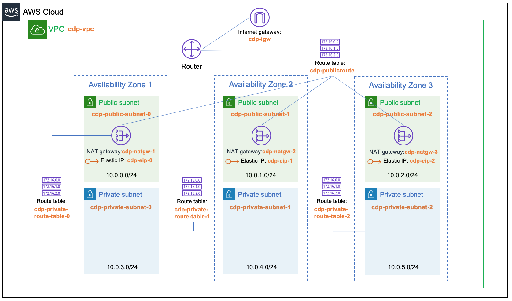

# cdp-aws
 
This repo contains various bits to make it easier to bring up Cloudera Data Platform (CDP) Public Cloud up in AWS.

I've placed 3 modules each in its own directory as they're designed to be include-able from a common main.tf file.  
We currently have:
- cross-account-role - Create IAM role for CDP management access
- S3  - Create the S3 bucket with Default Encryption and the logs folder 
- VPC - Create the VPC structure that is needed for the CCM/Private IPs feature to work
- IAM - Create IAM Policies & Roles as per [CDP documentation](https://docs.cloudera.com/management-console/cloud/environments/topics/mc-idbroker-minimum-setup.html)

VPC Networking Diagram

How to use

1. Install & Configure Terraform for your AWS account (either via a aws cli profile or by entering your access key)
2. cd into the appropriate example directory (examples/full, examples/iam_only)
3. set up an IAM user or role and use via in your ~/.aws/config file.  For details on all your options, please visit the [official AWS-CLI documentation](https://docs.aws.amazon.com/cli/latest/userguide/cli-configure-files.html)
4. Adjust your variables.tf so that match your deployment expectation
4. Run `terraform init` 
5. Run `terraform plan` to do a dry run and `terraform apply` to do the real thing

Video Instructions for module configuration
- IAM: https://youtu.be/CStOiWKmb28
- S3:  https://youtu.be/pu_Y_EpYvps
- VPC: https://youtu.be/93-qsSTSXX0

 PS: Don't forget to set up a ssh tunnel or a proxy in a bastion host so that you can access the CDP endpoints from your network.
